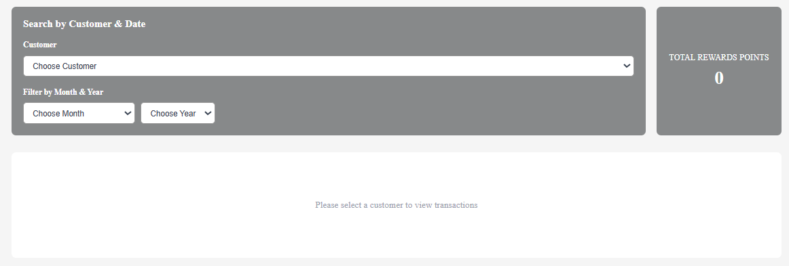
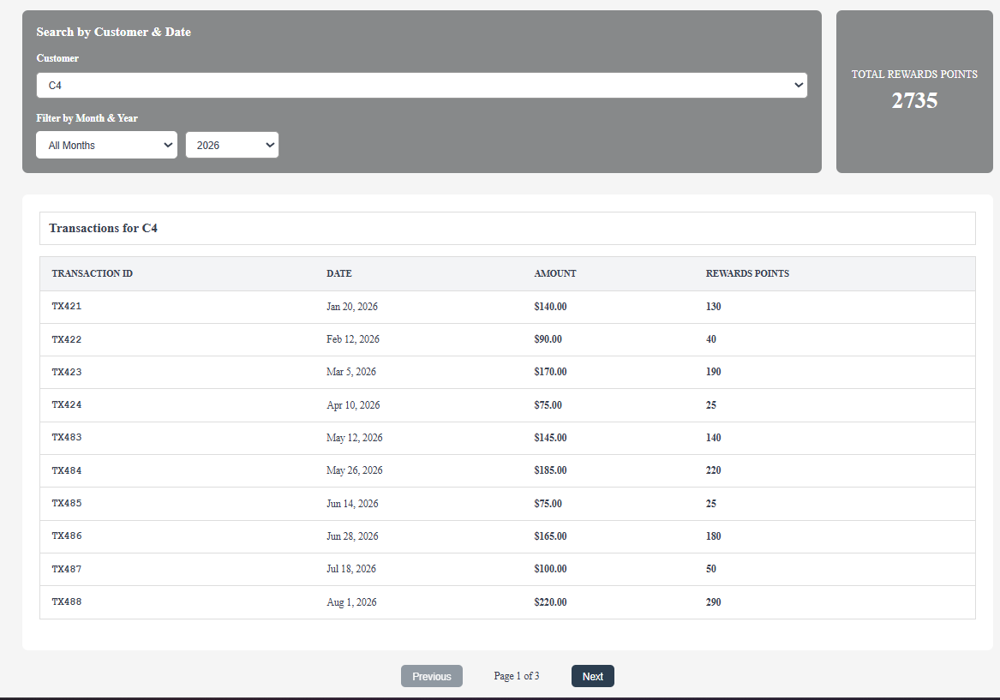
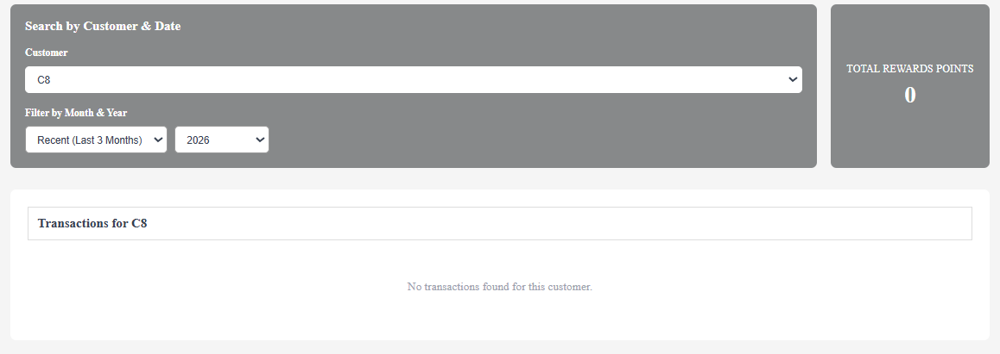
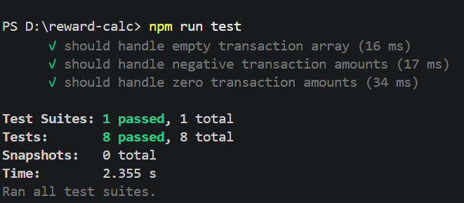

# Customer Rewards Dashboard

A React-based application that calculates and displays customer rewards points based on transaction amounts with tiered reward logic.





## Reward Logic

- 0 points for purchases ≤ $50
- 1 point per dollar for purchases $50-$100
- 2 points per dollar + $50 bonus for purchases > $100

---

## Project Setup

### Prerequisites
- Node.js v18+ 
- npm v9+

### Installation

```bash
cd reward-calculator
npm install
```

---

## How to Run

### Development Server
```bash
npm run dev
```
Visit `http://localhost:5173/` to view the app.

### Production Build
```bash
npm run build
npm run preview
```

### Testing
```bash
npm test              # Run all tests
npm test -- --watch   # Run tests in watch mode
npm test -- --coverage # Run tests with coverage report
```

---

## Component Details

### Core Components

#### App.jsx
Main application component that orchestrates data fetching, state management, and routing to the app layout. Handles loading and error states.

#### AppLayout
Layout wrapper component that renders the main application structure with AppHeader, FilterSection, and MainContent. Receives all state and handlers as props.

#### AppHeader
Header component displaying the application title and branding at the top of the page.

### Layout Components (layout/)

#### FilterSection
Container component that manages the filter UI layout, combining customer selection and date filtering options.

#### MainContent
Container component that orchestrates the display of reward points card and transaction table based on selected customer and filters.

### Filter Components (filters/)

#### FilterPanel
Customer and time period selection component with dropdowns for:
- Customer selection
- Month selection (specific month, recent 3 months, or all months)
- Year selection

### Transaction Components (customersTable/)

#### CustomersTable
Parent component managing transaction display, pagination, and data flow. Handles the overall structure of transaction presentation.

#### TransactionTable
Renders transactions in a table format with columns for:
- Transaction ID
- Date (formatted)
- Amount
- Calculated Reward Points

#### TransactionRow
Individual transaction row component displaying a single transaction with formatted date, amount, and calculated points.

#### Pagination
Navigation controls (Previous/Next buttons) for paginated transaction data. Displays 10 items per page with page indicators.

#### EmptyState
Placeholder component showing contextual messaging when:
- No customer is selected
- No transactions found for selected filters

### UI Components

#### ErrorPage
Error display component for showing error messages to users during failures.

#### Loading
Loading spinner component displayed during data fetching operations.

#### RewardPointsCard
Summary card component displaying total accumulated reward points for the selected customer and time period.

---

## Custom Hooks

### useFetchData
Manages data fetching from the API, grouping transactions by customer, and handling loading/error states. Returns:
- `customerTransactionsByID`: Grouped transaction data
- `isDataLoading`: Loading state
- `errorMessage`: Error message (if any)

### useAppState
Manages application-level state including:
- `filteredMonthsCount`: Current month/year filter
- `selectedCustomerId`: Currently selected customer
- `totalRewardPoints`: Total reward points
- Event handlers for state updates

### useTransactions
Filters transactions based on customer ID and month/year filters. Applies reward calculation logic and returns filtered transactions with total points.

### usePagination
Manages pagination state for transaction table including:
- Current page
- Items per page
- Navigation between pages

---

## Utilities

### rewardUtils.js
- `calculatePoints(amount)`: Calculates reward points based on purchase amount using tiered logic
- `groupTransactions(transactions)`: Groups transactions by customer ID and month/year

### tableUtils.js
- `formatDate(dateStr)`: Formats transaction dates for display
- `sortCustomersAscending(customers)`: Sorts customer IDs in ascending order (numeric or alphabetical)

---
